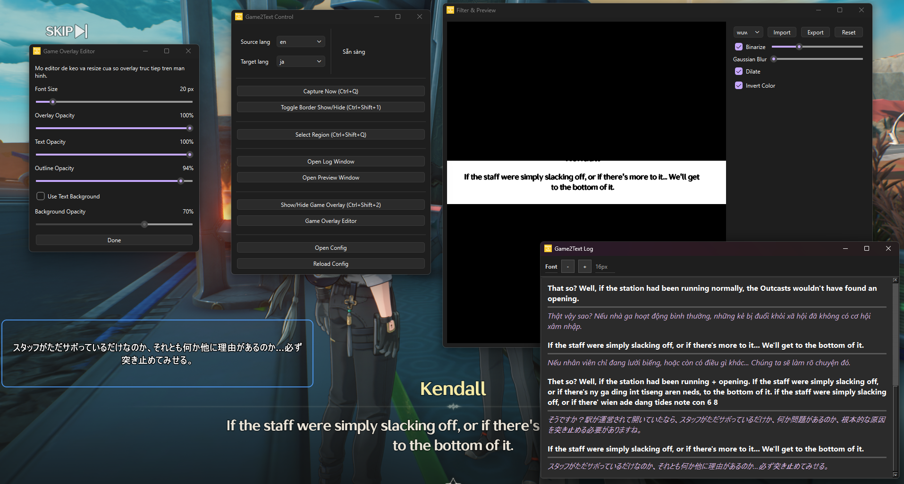

# Game2Text Renewal

This is a small app I made while playing **Wuthering Waves** to make the game easier to play. The game does not support Vietnamese, which is my native language, so this project exists mainly to bridge that gap.

Download the latest release [here](https://github.com/huynhnguyen1906/Game2Text-renewal/releases/latest).



## Features

- Translate a selected on-screen text region
- Game overlay that shows the latest translated line
- Filter preview for the selected OCR region
- Log window for OCR text and translated output
- Overlay editor for position, size, font, and overlay appearance

## Translation

The translation flow currently uses an **OpenAI API key**.

I may add more translation services later if I have time.

To use the app:

1. Open `config.ini`
2. Paste your key into:

```ini
openai_api_key =
```

## Development Environment

- Windows
- Python 3.10
- PySide6
- Tesseract OCR
- OpenAI Python SDK
- PyInstaller

Install dependencies from project root:

```powershell
.\venv\Scripts\Activate.ps1
pip install -r .\requirements-native.txt
```

## Run

From project root:

```powershell
.\venv\Scripts\Activate.ps1
python .\native_app.py
```

## Build

From project root:

```powershell
.\build_native.bat
```

Build output:

```text
dist/native-game2text/
```

## Upstream Attribution

This project is derived from and heavily modified from
[mathewthe2/Game2Text](https://github.com/mathewthe2/Game2Text).

The original upstream project is licensed under the Apache License 2.0.
This repository contains substantial modifications, a native standalone runtime,
and additional code that are not part of the official upstream project.

This repository is not an official upstream release and is not maintained by
the original Game2Text author.

## License

This repository is distributed under the Apache License 2.0. See
[LICENSE](LICENSE) and [NOTICE](NOTICE).
